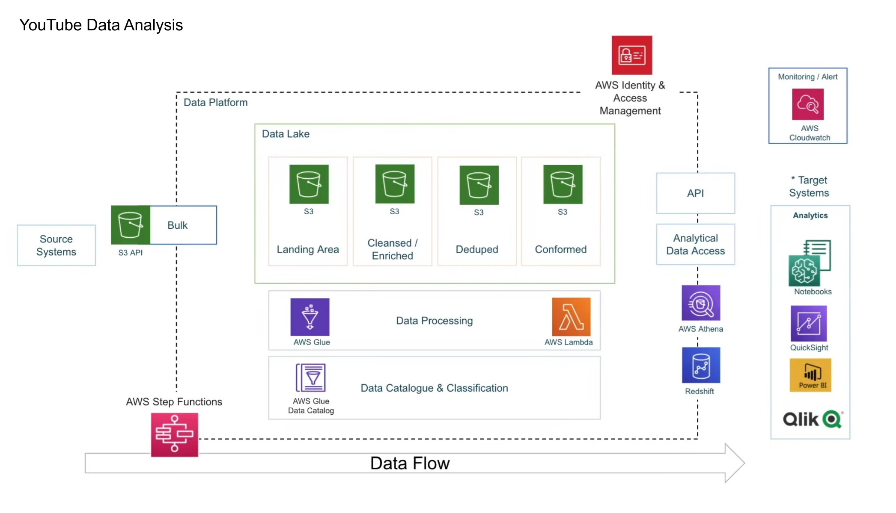

# Data Engineering Project - YouTube Trends Analysis Pipeline

#### Objective
To build a system for securely managing, analyzing, and reporting on structured and semi-structured YouTube video data, categorized by video type and trending metrics.

#### Workflow

1. Pull data into S3 bucket.  
2. Use AWS Glue to clean, categorize, and structure the data.  
3. Store both raw and processed data in S3.  
4. Use Athena to analyze trends and metrics without moving data.  
5. Use QuickSight for dashboards showing trends, engagement, and category performance.

> Note: For saftey reasons, all AWS keys and credentials are replaced with placeholders.

#### AWS Services used:

- Amazon S3 for centralized storage of all ingested data.  
- IAM to control and secure access to resources.  
- AWS Glue to prepare, clean, and transform the data for analysis.  
- Lambda function executes the data processing tasks without need for server management (EC2 instance).  
- AWS Athena for querying and analyzing data directly from S3.
- AWS QuickSight will create interactive dashboards for reporting.  
